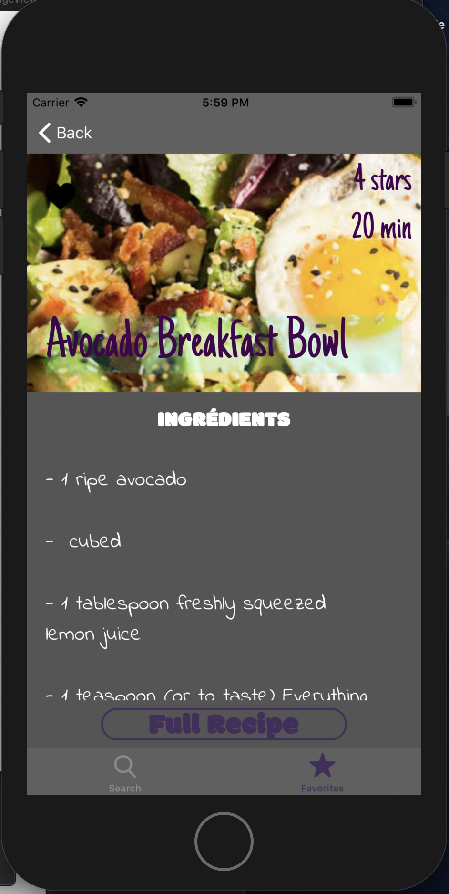

# Reciplease

 

**Reciplease** is an app's that help you to find the best recipes depending ingredients you have on your Fridge
- On *page Ingredients* you can add or delete ingredients needed
- On *page Recipes* Shearch will appear the 10 recipes that match your ingredients
- From there you will be able to open *page Recipe*  with recipe details and  open also web recipe page in order to have full recipe.
- Also no matter where you will be able to add any recipe to your *favorite* and consult recipe without be connected

**Focus** have been done on the following aspects :
- Core Data
- Cocoa Pod Alamofire
- API call (Yummly)
- UiTableView 
- MVC 
- Unit Tests

## Start
Supports: IOS 11.x and Above
Swift 5

## Dependencies

Please get an API Key from :
-  For **Yummly** : <a href="https://developer.yummly.com">Yummly.com</a>

File **Apikeys.plist** have been not shared in Git. Please create a new one and your personal Api key
