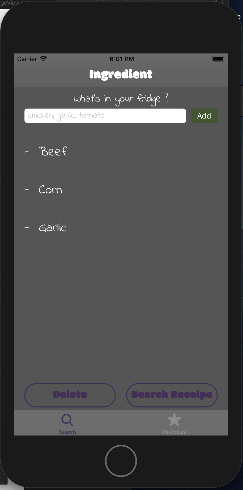

# Reciplease

 

**Reciplease** is an application that helps you to find the best recipes based on the ingredients you have in your Fridge

- One *page Ingredients* where you can add or delete ingredients 
- One *page Recipes* will display 10 recipes that match your ingredients
- One *page Recipe*  which shows the recipe details and a link to Yummly web recipe page in order to have full recipe.
- Also you will be able to add any recipe to your *favorite* and view the recipe without internet connection

**Focus** have been done on the following aspects :
- Core Data
- Cocoa Pod Alamofire
- API call (Yummly)
- UiTableView 
- MVC 
- Unit Tests

## Start
Supports: IOS 11.x and Above
Swift 5

## Dependencies

Please get an API Key from :
-  For **Yummly** : <a href="https://developer.yummly.com">Yummly.com</a>

File **Apikeys.plist** have been not shared in Git. Please create a new one and your personal Api key
